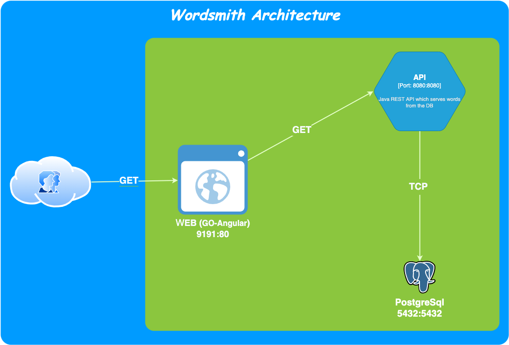

# Docker & Docker Compose Workshop

In this workshop, we will work with the **Wordsmith** application which is the demo project shown at DockerCon EU 2017 and 2018.

**NB:** Please try to find your own solutions before getting response from the repository.

## Architecture Schema



***

## Preamble

We have 3 containers to manage for Wordsmith App.

- **db** : is a Postgresql database which stores words like Nouns, Adjectives and Verbs.


- **api** : is a Java REST API which serves words read from the database and expose them through specific endpoints.


- **web** : is a Go web application which calls the **api** and builds words into sentences

***

## Instructions

1. Clone the project in your local machine.

```shell
git clone git@github.com:codeworks-secops/docker-and-docker-compose-workshop.git
```

2. Checkout the `code-base` branch to start.

```shell
git checkout code-base
```

***